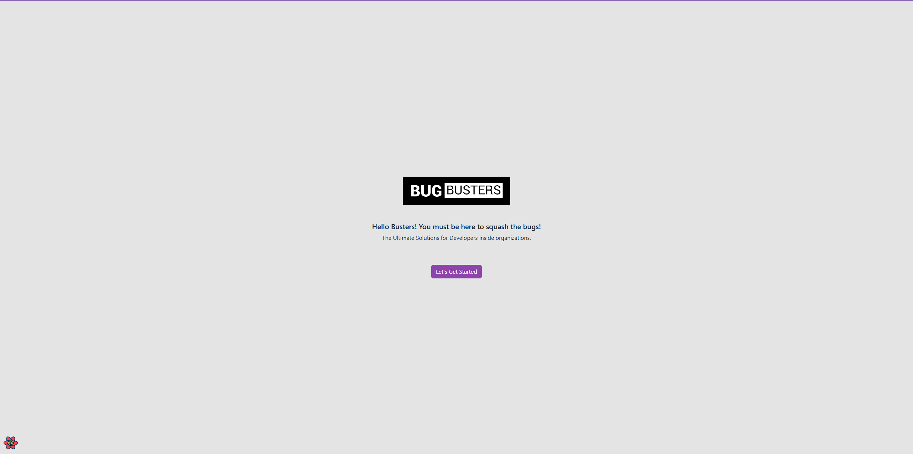

# BugBusters

Welcome to **BugBusters**, a comprehensive full-stack application designed to facilitate company-specific developer collaboration. Inspired by platforms like StackOverflow, BugBusters provides a private, secure, and feature-rich environment for employees to share issues, provide solutions, and foster a collaborative workspace.

---

## Overview

This portfolio showcases the two major components of the BugBusters project:

1. **[BugBusters Server](https://github.com/biswajitpanday/BugBusters.Server)**: The backend API built with ASP.NET Core, supporting robust functionalities like user management, Q&A systems, and role-based access control.
2. **[BugBusters Client](https://github.com/biswajitpanday/BugBusters.Client)**: The frontend application developed with React, offering an intuitive and responsive user interface for users to interact with the system.

---

## Features

### Server
- **User Management**: Registration, login, and role-based access control (Admin, Moderator, User).
- **Q&A Functionality**: 
  - Post, answer, and vote on questions.
  - Admin approval for publishing questions and answers.
- **Clean Architecture**: Built with industry best practices, leveraging ASP.NET Core, Entity Framework, and JWT authentication.
- **Logging and Testing**: Integrated Serilog for logging and NUnit/Moq for unit testing.

### Client
- **User-Friendly Interface**: 
  - Post and browse questions.
  - Answer questions with rich text formatting.
- **Advanced Features**:
  - Upvote/downvote content.
  - Real-time updates and responsive design.
- **Rich UI Components**: Built with React, Redux, and Bootstrap for seamless user experience.
- **Search and Navigation**: Search functionality to quickly find relevant topics.

---

## Technology Stack

### Backend (Server)
- **Framework**: ASP.NET Core 7
- **Database**: SQL Server with Entity Framework Core
- **Authentication**: JWT-based
- **Testing**: NUnit, Moq
- **Architecture**: Clean Architecture with Repository Pattern

### Frontend (Client)
- **Framework**: React 18
- **State Management**: React Query, Context API
- **Styling**: Sass, Bootstrap
- **Routing**: React Router DOM
- **Rich Text**: TinyMCE, Stacks Editor
- **Testing**: Jest, React Testing Library

---

## How to Explore This Project

### 1. Clone the BugBusters.Server & BugBusters.Client Repositories
```bash
git clone https://github.com/biswajitpanday/BugBusters.Server.git
cd BugBusters.Server
git clone https://github.com/biswajitpanday/BugBusters.Client.git
cd BugBusters.Server
```

### 2. Access Individual Repositories
- **[BugBusters Server](https://github.com/biswajitpanday/BugBusters.Server)**:
  - Follow the setup instructions in the server README to get the backend running.
- **[BugBusters Client](https://github.com/biswajitpanday/BugBusters.Client)**:
  - Follow the setup instructions in the client README to get the frontend running.

---

## Running Locally

### Server Setup
1. Clone the server repository:
   ```bash
   git clone https://github.com/biswajitpanday/BugBusters.Server.git
   cd BugBusters.Server
   ```
2. Install dependencies and apply migrations:
   ```bash
   dotnet restore
   dotnet ef database update
   ```
3. Start the server:
   ```bash
   dotnet run
   ```

### Client Setup
1. Clone the client repository:
   ```bash
   git clone https://github.com/biswajitpanday/BugBusters.Client.git
   cd BugBusters.Client
   ```
2. Install dependencies:
   ```bash
   npm install
   ```
3. Start the development server:
   ```bash
   npm start
   ```

---

## Screenshots

### Landing Page


### BugBusters Client (Screenshots)
- **Question List Page**  
  

- **Question and Answer Page**  
  

### BugBusters Server (Swagger API)


---

## License

This project is licensed under the MIT License. See the individual repositories for more details.

---

## About

Developed by **[Biswajit Panday](https://github.com/biswajitpanday)**.  
For inquiries or support, feel free to contact me at [biswajitmailid@gmail.com](mailto:biswajitmailid@gmail.com).

---

## Contributing

Contributions are welcome!  
Please fork this repository and submit a pull request for your changes.
